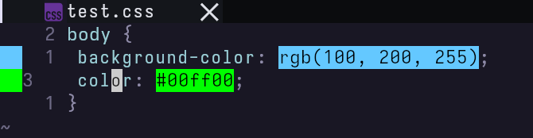

# nvim-virtual-colors

this plugin displays the color in css directly in the editor, imitating "color decorators" from vscode.



## installing

with Plug:
```lua
Plug 'aki-masaki/nvim-virtual-colors'
```

## usage

for the plugin to work, you have to `require` it in your `init.lua`:
```lua
require('nvim-virtual-colors').setup{}
```

## config

here are the default values
```lua
{
    -- can be:
    --     bg    - will display the color as the backround of the whole expression
    --     bg-fn - will display the color as the background of just '#' and 'rgb'
    --     block - will display a colorized block character before the color
    display = 'bg',
    -- the sign column is before the line numbers
    display_on_sign_column = true
}
```
